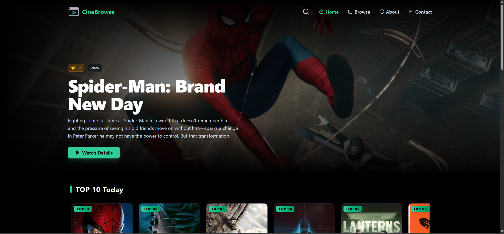
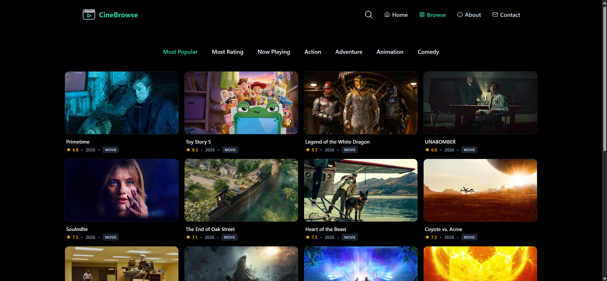
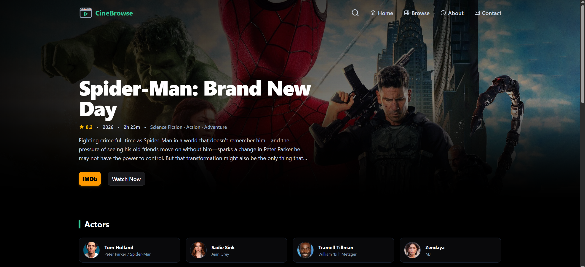
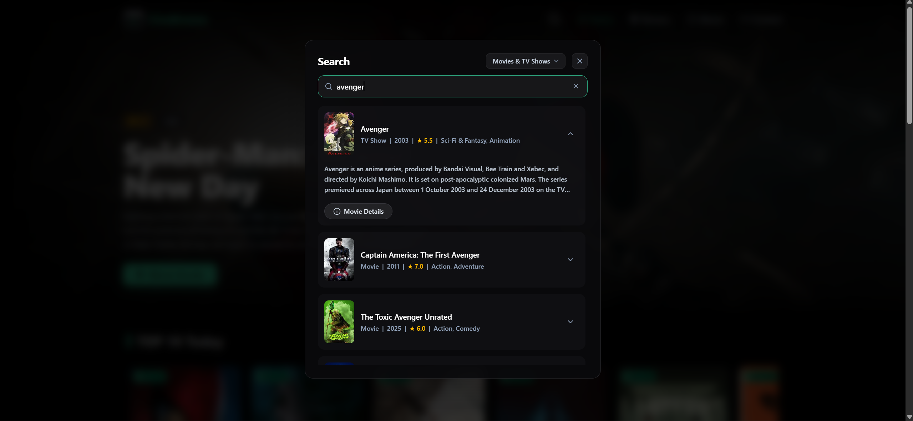

# CineBrowse

A responsive single-page movie and TV discovery platform built with **React** and the **TMDB API**.

## Features

- Movie and TV show discovery powered by TMDB
- Multiple categories including Top 10, Trending, Top Rated, Comedy, and Action
- Movie and TV show search with 300 ms debouncing
- Dynamic movie and TV show detail pages
- Client-side routing with React Router
- Infinite loading on the Browse page
- Shimmer loading UI

## Tech Stack

- React
- JavaScript
- React Router
- Tailwind CSS
- TMDB API

## Screenshots

### Home

### Browse

### Movie Details

### Search

## Getting Started

### Prerequisites

- Node.js
- npm
- TMDB API key

### Installation

Clone the repository:

    git clone https://github.com/yashwanths1101/CineBrowse.git
    cd CineBrowse

Install dependencies:

    npm install

### Environment Variables

Create a `.env` file in the project root:

    VITE_TMDB_API_KEY=your_tmdb_api_key
